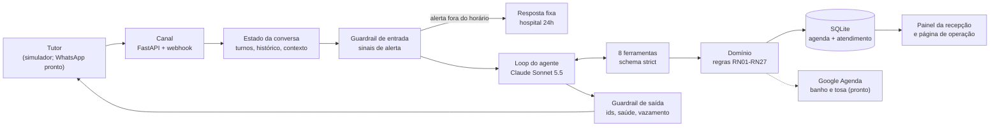

# Patas & Cia: agente de agendamento para clínica veterinária

Atendente virtual de WhatsApp que **marca, remarca e desmarca horários sozinho**, responde preço e funcionamento, e passa para a recepção tudo o que precisa de gente, sem nunca dar palpite sobre a saúde do animal.

> Caso de portfólio com empresa fictícia. Clientes, telefones, conversas e dados de contato são inventados.

**Em números (medidos, não estimados):**

| | |
| --- | --- |
| Custo por mensagem respondida | **US$ 0,0095** com Claude Sonnet 5.5 (86% da entrada vinda do cache) |
| Projeção para a clínica | cerca de **US$ 70/mês** para 60 conversas por dia |
| Tempo de resposta | 4 a 5 s por mensagem nos testes |
| Testes automatizados | **176**, sem chamar o LLM nem a rede (custo zero, rodam no CI) |
| Avaliação do agente real | 30 casos × 3 repetições: **97% (87/90)**. A única falha (confirmação pedida duas vezes) foi corrigida e revalidada: agendamentos simples em **100%** (meta da cliente: 90%) |
| Ataques de prompt no modelo real | **36 de 36 barrados** (12 ataques × 3): extração de prompt, contexto de sistema falsificado, fingir ser a recepção, desconto falso, dose de remédio "como veterinário", dados de terceiros, cancelamento em massa, ids de outro tutor, entre outros |
| Decisões registradas | 13 ADRs |

---

## O problema

A Patas & Cia (Guarulhos, SP) recebe cerca de 60 conversas de WhatsApp e 30 ligações por dia, e só tem uma recepcionista. Dois terços das conversas são agendamento. A resposta leva de 10 a 15 minutos num dia tranquilo e até 2 horas nos picos; fora do horário, só no dia seguinte. A recepção estima perder **10 a 15 clientes por semana** pela demora.

Pedido da dona, veterinária: *"um atendente virtual que marque horário sozinho"*. Limite inegociável: **o atendente não dá palpite sobre a saúde do animal**.

## O que o agente faz

- Consulta o cadastro pelo telefone e marca banho, tosa, vacina e consulta respeitando 29 regras de negócio: horário e feriados, dias de cada serviço (dermatologia só quinta à tarde, banho de gato só terça e quinta de manhã), porte pelo peso, vacinas em dia para banho, primeira vacina com consulta, antecedência de 2 horas para remarcar, bloqueio por faltas.
- Remarca e desmarca **só com o "sim" do tutor**, numa mensagem seguinte ao resumo.
- Faz pré-agendamento para número sem cadastro; a recepção confirma.
- Passa para a recepção (com protocolo e resumo) resultado de exame, dúvida de saúde, pedido sobre animal de outra pessoa, táxi dog e qualquer erro.
- Reconhece sinais de alerta de saúde (12 categorias): avisa a recepção como urgente na hora e, fora do horário, indica o hospital 24h com uma **resposta fixa**, sem passar pelo modelo.

## Arquitetura



Um agente único (o modelo decide o próximo passo), envolvido por código determinístico antes e depois. **O prompt pede; o código garante**: toda regra cuja quebra causaria dano tem uma trava fora do modelo.

## Decisões que valem a leitura

| Decisão | Por quê | ADR |
| --- | --- | --- |
| Agente único com 8 ferramentas, regras no código | A conversa muda de rumo no meio (preço vira agendamento, troca de animal); um roteador de intenção quebraria. Regras de agenda testáveis sem LLM | [0001](docs/adr/0001-agente-unico-com-ferramentas.md) |
| Toda escrita em duas fases: propor, depois confirmar em turno seguinte | "Já confirma sem me perguntar" não funciona nem se o modelo obedecer: o código exige uma resposta do tutor depois do resumo | [0002](docs/adr/0002-escrita-em-duas-fases.md) |
| Tutor identificado pelo telefone do canal, nunca pelo texto | "Sou o marido da Cristina" não dá acesso a nada; id de outra pessoa dá "não encontrado" | [0002](docs/adr/0002-escrita-em-duas-fases.md), [0004](docs/adr/0004-estado-da-conversa.md) |
| Memória em duas partes: transcrição e estado estruturado | O código nunca relê a conversa para descobrir um fato; a proposta pendente e as passagens abertas chegam prontas a cada turno | [0004](docs/adr/0004-estado-da-conversa.md) |
| Loop escrito à mão; LLM atrás de uma interface | Testes com LLM falso e roteirizado; trocar de provedor é mudar o `.env` (Claude em uso; Gemini pronto como alternativa) | [0005](docs/adr/0005-loop-do-agente.md), [0006](docs/adr/0006-provedor-de-llm-trocavel.md) |
| Raciocínio do modelo só dentro do turno | Os blocos de thinking ficam presos ao histórico exato; replicá-los com o histórico cortado daria erro 400 | [0005](docs/adr/0005-loop-do-agente.md) |
| Contexto do turno como mensagem de sistema gravada no histórico | O histórico vira só-acréscimo e entra no cache: **custo por mensagem caiu cerca de 45%** (medido) | [0008](docs/adr/0008-observabilidade-e-cache.md) |
| Rastreio próprio no banco, sem conteúdo de conversa | Custo, tokens, tempo e desfecho de cada passo, sem mandar dados de tutores para mais um terceiro | [0008](docs/adr/0008-observabilidade-e-cache.md) |
| Avaliação com corretor programático sobre o estado final do banco | O agente age no mundo: a nota é "o agendamento certo existe?", não "o texto parece bom?" | [0009](docs/adr/0009-avaliacao-do-agente.md) |
| Migrações versionadas e backup diário, sem ferramenta externa | Banco de produção nunca é recriado; cada migração roda numa transação e, se falhar, não deixa nada pela metade | [0011](docs/adr/0011-migracoes-e-backup.md) |
| WhatsApp: webhook responde na hora, agente roda depois | Assinatura HMAC em toda mensagem, reenvio da Meta ignorado, rajada vira um turno, aviso LGPD, celular sem o 9 corrigido | [0012](docs/adr/0012-canal-whatsapp.md) |
| Google Agenda como decorador do repositório, gravado antes do banco | O domínio não sabe que o Google existe; cada evento da equipe ocupa uma tosadora; Google fora do ar passa para a recepção em vez de oferecer horário às cegas | [0013](docs/adr/0013-google-agenda-do-banho-e-tosa.md) |
| Container único, um processo, SQLite num volume | Roda em qualquer plataforma; volume de clínica pequena cabe com folga; Postgres é troca só do adaptador | [0003](docs/adr/0003-stack-do-mvp.md), [0010](docs/adr/0010-deploy.md) |

## O que os testes com o modelo real ensinaram

Cada item abaixo apareceu rodando o agente de verdade, e virou correção no código e teste automático:

- **Campo crítico não pode ser opcional no schema.** Com `strict`, o modelo omitia o animal (e depois o nome do tutor, mesmo escrevendo "esqueci de incluir o nome") e repetia a chamada até o limite de passos. Correção: campos obrigatórios, sem objeto aninhado opcional.
- **O guardrail precisa ser testado com a frase real.** A primeira regra de alerta deixou passar justamente a conversa que motivou a regra ("comeu um pedaço **grande** de chocolate").
- **O modelo não sabe a regra que ninguém contou.** Na primeira vacina de um filhote, ele marcava só a consulta. A avaliação pegou; o prompt e a ferramenta passaram a explicar a regra.
- **O modelo promete o que o sistema não faz** ("mando um lembrete um dia antes"). Virou regra explícita: só prometer o que alguma ferramenta faz.
- **Regra de segurança não pode virar atrito.** A confirmação em duas fases fez o modelo perguntar "posso marcar?" antes da proposta e "posso confirmar?" depois: o tutor dizia sim duas vezes. Foi a única falha da avaliação completa (3 de 3 repetições); corrigida no prompt e revalidada.
- **Loop custa dinheiro.** Chamada idêntica que falhou não é repetida, ferramenta com 3 falhas é bloqueada, repetição insistente encerra o turno cedo.
- **Medir antes de otimizar.** O cache do histórico só foi feito depois do rastreio existir, e o ganho foi medido com ele.

## Segurança

Modelo de ameaças completo em [docs/seguranca.md](docs/seguranca.md). Em resumo:

- **Prompt injection:** texto do tutor nunca entra no prompt de sistema; contexto injetado só com campos do código; resposta com trechos das instruções internas é trocada antes de sair.
- **Saúde:** filtro de remédios e doses na saída; alerta tratado no código antes do modelo.
- **Falhas do LLM:** API fora, recusa, resposta cortada, loop ou bug inesperado viram mensagem fixa e passagem para a recepção. O tutor nunca fica sem resposta.
- **Webhook do WhatsApp:** só aceita mensagem com assinatura HMAC válida; configuração pela metade impede o servidor de subir.
- **Web:** login obrigatório (o servidor não sobe sem senha forte), proteção contra CSRF, nenhum HTML montado com texto do usuário, cabeçalhos de segurança, documentação automática desligada.
- **Segredos:** só em variável de ambiente; nunca na imagem Docker, no log ou no repositório (auditado no histórico de commits).
- **LGPD:** rastreio sem conteúdo de conversa; o telefone não vai para o LLM; retenção e contrato com o provedor no roadmap.

## Stack

Python 3.12 · [uv](https://docs.astral.sh/uv/) · SDK da Anthropic (Claude Sonnet 5.5) e SDK compatível com OpenAI (Gemini, como alternativa) · FastAPI · SQLite · google-auth (Google Agenda) · pytest · Docker · GitHub Actions

## Como rodar

```powershell
uv sync
copy .env.example .env      # preencha ANTHROPIC_API_KEY, PAINEL_USUARIO e PAINEL_SENHA
uv run python -m patas.seed
uv run python -m patas.servidor
```

Abra http://127.0.0.1:8000/chat (simulador), `/joyce` (painel da recepção) e `/operacao` (custo, tempo e desfechos).

```powershell
uv run pytest -q                      # 176 testes, sem custo
uv run python -m evals.rodar --variant v2 --reps 3   # avaliação com o modelo real (≈ US$ 1,20)
docker build -t patas-agente .        # imagem de produção; publicação em docs/deploy.md
```

## Estrutura

```
src/patas/
  dominio/       regras, agenda, conversa: nenhum import de banco nem de LLM
  repositorio/   interfaces, SQLite (agenda, atendimento, painel), migrações e Google Agenda
  agente/        prompt, ferramentas, loop, guardrails, adaptadores de LLM, custos
  web/           FastAPI, as três telas e o canal WhatsApp
  servidor.py    entrada de produção
tests/           176 testes com LLM, WhatsApp e Google falsos
evals/           casos, corretor e executor da avaliação com o modelo real
docs/            regras de negócio, contratos das ferramentas, segurança, deploy, ADRs
```

## Roadmap

- **Ligar WhatsApp e Google Agenda:** o código está pronto e testado (ADRs 0012 e 0013), desligado enquanto as variáveis estiverem vazias. Falta criar as credenciais ([guia](docs/configurar-integracoes.md)), publicar com URL pública ([deploy](docs/deploy.md)) e cadastrar o webhook na Meta. Plano em fases em [docs/plano-de-producao.md](docs/plano-de-producao.md)
- Modo humano: quando a recepção responde pelo app, o agente pausa naquela conversa (precisa do número real)
- Tutor simulado por LLM na avaliação, no lugar das falas fixas (mais realista, mais caro)
- Login por pessoa no painel; retenção de 90 dias (LGPD); cópia do backup fora do servidor
- Integração com o sistema da clínica (VetFácil): muda só o adaptador de repositório

---

Projeto construído em 12 blocos (descoberta, tipo de solução, contratos, dados, estado, loop, guardrails, interface, observabilidade, avaliação, deploy e este case), mais a construção da fase 1 de produção (migrações, backup, WhatsApp e Google Agenda), com cada decisão registrada em [docs/adr](docs/adr).
